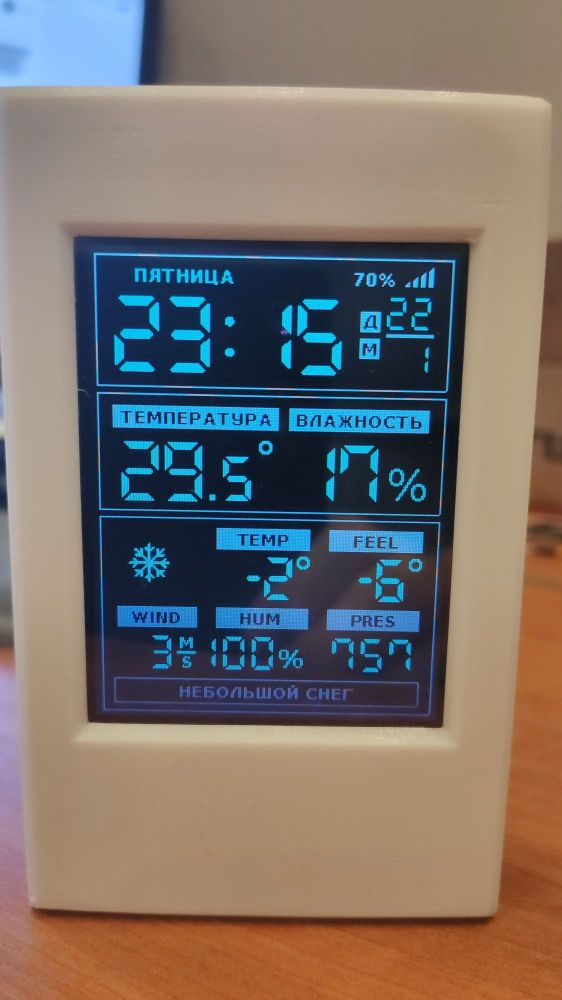

# esp8266-weather-station-ru
Что тут скажешь? Очередная тысяча первая метеостанция.

Данные получаем с openweathermap.org. 
Необходимые поля для заполнения:

- WIFI_SSID "....."
- WIFI_PASS "....."
- OPEN_WEATHER_MAP_APP_ID = "..............";

Аппаратная часть:
- WEMOS D1 mini
- датчик DHT22 (DHTPIN D4)
- экран ILI9341 разрешением 320х240. Я использовал диагональ 3,2".
- фоторезистор типа GL5516 с резистором 10кОм на землю. (PIN_PHOTO_SENSOR A0, PIN_LED D8)

Очень уж мне понравился проект https://github.com/ThingPulse/esp8266-weather-station-color 
с использованием библиотеки Mini Grafx https://github.com/ThingPulse/minigrafx от squix78 (Daniel Eichhorn) https://github.com/squix78.
Одна беда - нет поддержки русского языка. Никак. Обращался к авторам за помощью, но увы. Поддержка кириллицы их не заинтересовала.
И тогда я достал из шкафа изделие ЛО-1М ( лом обыкновенный 1 метр), в общем пошел другим путем: просто сделал нужные шрифты, где взамен латиницы отображается кирилица. 
Это же метеостанция, с конечным числом сообщений требующих отображения. И ничто не мешает полученный от openweathermap.org текст описания погоды, например "fog", сопоставить с "TUMAN", а созданным шрифтом отображать это как "ТУМАН".
Таблица соответствия находится в файле weathericons_mini.h.
Я убрал присутствующие в оригинальном проекте дополнительные экраны прогнозов и разместил всю необходимую мне информацию на дисплее. 
Считывается одним взглядом.
Для комфортного использования, с помощью фоторезистора в темном помещении регулируется яркость подсветки экрана и меняются цвета на менее яркие.
Не удивляйтесь, что на экране таки есть английские заголовки параметров. Уж больно длинные у нас слова получаются. Выбирая для температуры между "ОЩУЩАЕТСЯ" и "FEEL" предпочтение было отдано второму варианту.

Корпус делался на заказ на соседском 3D принтере. 
Чертежи рисовал онлайн https://www.tinkercad.com/
Модели в папке /3D_tsl

И конечно же главное ToDo: оптимизация шрифтов. Сейчас некоторые шрифты присутствуют в проекте в полном объеме, хотя нужны лишь пару символов. Надо сократить.
